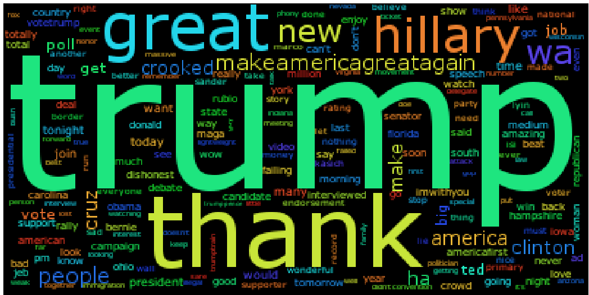
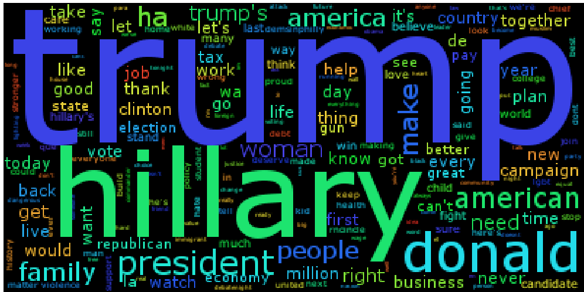

# twitter_political_platform_clustering
##Summary 
Clustering tweets on Key Issues from the Presidential Candidates of the 2016 US Election using NLP and ML

##Running Script 
```
$ python ./clustering_tweets.py
```

##Motivation 
Given this past US presidential election, it was apparent that voters were not always aware of the candidate's position on key issues. Thus voter's insights on candidates had been fragmented by the partial availability of data. This project aims to cluster the tweets of the presidential candidates of 2016 US Elections into clusters which represent a key issue. By doing so we can use machine learning to provide users with candidates' views on key issues. 

##Related Work 
The clustering method follows an exemplar-based approach based on the paper "Exemplar-Based Topic Detect in Twitter Streams" by Ahmed Elbagoury and Rania Ibrahim (http://www.aaai.org/ocs/index.php/ICWSM/ICWSM15/paper/viewFile/10533/104540). In this paper, the method introduced extracts tweets based on their variance from their similarity with other tweets. This is based on the grounds that a tweet's similarity to a group of tweets will fall under three cases: 
  1. The tweet is ubiquitous to the group. It will have low variance. 
  2. The tweet is similar to only a certain group of tweets, giving it a high variance. 
  3. The tweet is not similar to any tweets in the group. It will also have a low variance.
Thus from these 3 cases, the tweets that fall under case 2 can be said to be exemplar tweets. These tweets can then act as our centroids of a topic cluster. 

##Implementation 
###Tweets 
This clustering algorithm was implemented using the Hillary Clinton and Donald Trump Tweets dataset on kaggle (https://www.kaggle.com/benhamner/clinton-trump-tweets). 


##Data Exploration and Preprocessing
Intuitively, I would believe that the candidates would use twitter as a medium to explain key elements of their platform to the public. To analyze the data I thought by filtering the tweets and creating a word cloud of each candidates tweets, there would be key words that would appear ('immigration','jobs','military',etc.). I preprocessed the data by: 
  1. Tokenizing the tweets
  2. Filtering out punctuation and twitter handles
  3. lemmatizing all tokens 
  4. Filtering out stopwords 

After preprocessing the tweets, the wordclouds generated failed to abide by my assumptions: 
__Donald Trump Tweets__


__Hillary Clinton Tweets__
 

As we can see the most frequent terms that candidates tweeted were their rivals. What stood out to me most was that Hillary's tweets talked most about Tump, but Trump's tweets also talked most about himself. Thus after looking at the tweets, I was unsure of the success of clustering by topic but decided to continue pursuing the goal.

##Clustering 
After viewing the data, I hoped that topics could be detected in the tweets through calculating variance on the similarity scores of each tweet's tfidf value. By calculating the tfidf values, hopefully words like 'Trump' and 'Hillary' would be tagged as unimportant. Thus clustering followed the procedure of: 
  1. Generating the tfidf of each candidate's tweets where each tweet would be considered as a document. 
  2. Creating a similarity matrix between the tweets where cosine distance is used as the similarity function. 
  3. Calculating mean and variance of each row of the similarity matrix. This would give us the variance of each tweet. 
  4. Selecting the 10 tweets with the highest variance. Tweets were also selected if they had a cosine similarity of 0 between the previous exemplar tweet, this would allow for exemplar tweets to be selected that represented different topics. 
  5. Clustering the remaining tweets based on which exemplar tweet they had the highest similarity to. 
  6. Generating a tfidf matrix of the clusters.  
  7. combining clusters of the candidates based on which clusters have the highest cosine similarity. 
  

After performing the clustering process, our output does not look promising: 
```
----------------cluster:  0 ------------------
TRUMP: Join me for a pm rally - tomorrow at the Mid-America Center in Council Bluffs, Iowa! Tickets: https://t.co/dfzsbICiXc 

TRUMP: The media is going crazy. They totally distort so many things on purpose. Crimea, nuclear, "the baby" and so much more. Very dishonest! 

TRUMP: Thank you Denver, Colorado! 
MakeAmericaGreatAgain! https://t.co/KHrLdkOyW 

TRUMP: "@FreemarketSara: Trump's Historic  Million Primary Votes - A Record ... Congratulations @realDonaldTrump https://t.co/zdOElewOL" 

TRUMP: Unlike crooked Hillary Clinton, who wants to destroy all miners, I want wages to go up in America. We will do so by bringing back jobs! 

TRUMP: Is Cruz honest? He is in bed w/ Wall St. &amp; is funded by Goldman Sachs/Citi, low interest loans. No legal disclosure &amp; never sold off assets. 

TRUMP: "@D: MaryBrigidMcManamon, Washington Post: Constitutionally speaking, Cruz simply isnt eligible to be president https://t.co/DBtTgsCil" 

TRUMP: Why does @CNN &amp; @andersoncooper waste airtime by putting failed campaign strategist, Stuart Stevens - who lost BIG for Romney - on the show? 

HILLARY: The question in this election: Who can put the plans into action that will make your life better? https://t.co/XreEYOicG 

HILLARY: "I learned from my family and my Methodist faith that were each called to do all the good we can for all the people we can." Hillary 

HILLARY: You can learn a lot about a person by the company they keep.

Here's some of the company Trump keeps: https://t.co/CjVayZG 

HILLARY: "He says women will start making equal pay as soon as they do as good a job as menas if we arent already." Hillary on @realDonaldTrump 

HILLARY: Donald Trump's tax plan would add $ trillion to the national debt over  years. That's "trillion"with a "t." https://t.co/oWRixLA 

HILLARY: Hillary's in Kentucky today talking with families about child care. Tune in to watch live: https://t.co/DeYgSaIzU https://t.co/igrQnU 

----------------cluster:  1 ------------------
TRUMP: Once again, we will have a government of, by and for the people. Join the MOVEMENT today! https://t.co/lWjYDbPHav https://t.co/uYwJrtZkAe 

TRUMP: Join me on Wednesday, May th at the Anaheim Convention Center!
Trump MAGA 
Tickets: https://t.co/mmPckHYrC https://t.co/xGkVbxTamz 

TRUMP: Numerous polls have me beating Hillary Clinton. In a race with her, voter turnout will be the highest in U.S. history-I get most new voters! 

HILLARY: If we stand together, there's nothing we can't do. 

Make sure you're ready to vote: https://t.co/tTgeqxNqYm https://t.co/QYmbbUNy 

HILLARY: FACT: Mike Pence advocated for legislation that allowed businesses to discriminate against LGBT people.
https://t.co/AmzlzkkY 

----------------cluster:  2 ------------------
TRUMP: On National VoterRegistrationDay, make sure you're registered to vote so we can MakeAmericaGreatAgain https://t.co/wibUEZON 

TRUMP: EXCLUSIVE: How Donald Trump's  million followers are crashing the Internet https://t.co/hVzyrTU https://t.co/lWkjmdyQQ 

TRUMP: Heading to Colorado for a big rally. Massive crowd, great people! Will be there soon - the polls are looking good. 

TRUMP: Despite spending $k a day on TV ads alone CrookedHillary falls flat in nationwide @QuinnipiacPoll. Having ZERO impact. Sad!! 

TRUMP: A massive blow to Obama's message - only , new jobs for month in just issued jobs report. That's REALLY bad! 

TRUMP: Don't reward Mitt Romney, who let us all down in the last presidential race, by voting for Kasich (who voted for NAFTA, open borders etc.). 

TRUMP: Thank you to @jdickerson and @FaceTheNation for a very fair and professional interview this morning. No wonder you are  in the ratings! 

TRUMP: "@ABCPolitics: .@realDonaldTrump led in @twitter conversation during the GOPDebate.  https://t.co/ZuMwroTdl" 

TRUMP: Yesterday in Iowa was amazing - two speeches in front of two great sold out crowds. They love that I am the only candidate self-funding! 

TRUMP: Pat Buchanan gave a fantastic interview this morning on @CNN - way to go Pat, way ahead of your time! 

HILLARY: ) Has Trump offered a single proposal to reduce the friction of starting a business. @HillaryClinton has https://t.co/OhFAFEFsUq 

HILLARY: When Donald Trump speaks about women, our daughters can hear him. https://t.co/rNRrV 

HILLARY: The birther lie is what turned Trump from an ordinary reality TV star into a political figure. That origin story can't be unwritten. 

HILLARY: Trump's detailed medical records are part of a laundry list of things he's hiding from the American public. https://t.co/uhlFknLvoP 

HILLARY: "I will not let the VA be privatized." Hillary https://t.co/FRkfAnSf NBCNewsForum 

HILLARY: "In Atlantic Cityyou will find contractors and small businesses who lost everything because Donald Trump refused to pay his bills" Hillary 

HILLARY: "I was so young that first time in Boston...maybe a little nervous addressing such a big crowd, but I was filled with faith. @POTUS 

HILLARY: "I humbly accept my party's nomination to be vice president of the United States!" Tim https://t.co/aCUajLyq 

HILLARY: "I already have a concentration camp...it's called Tent City." Joe Arpaio, Trump endorser and RNCinCLE speaker https://t.co/KHKqem 

HILLARY: Last night's RNCinCLE theme: "Make America Work* Again"

*Instructions not included https://t.co/rsIlwXFY 

HILLARY: "If anyone out there thinks this election is not important...think about the SCOTUS justices Donald Trump will nominate." @BernieSanders 

HILLARY: "In America, we dont begrudge people being successfulbut we do if they get rich by destroying other people." Hillary 

HILLARY: "I don't think a nation can be great that turns its back on the poor and the unfortunate." Hillary in  TBT
https://t.co/uPmFvosrB 

HILLARY: Made a new friend in Ohio.
https://t.co/aeqTuHn 

HILLARY:  reasons why Donald Trump should never become president (from members of his own party). https://t.co/gYEctRjSe 

HILLARY: Even if people dont vote for me in November, Im going to be for them and for you every single day. https://t.co/PpHOgsErpy 

HILLARY: "Somethings wrong when the median wealth for black families is just a tiny fraction of that for white families." Hillary 

----------------cluster:  3 ------------------
TRUMP: Hillary Clinton's Campaign Continues To Make False Claims About Foundation Disclosure: 
https://t.co/zhkEfUouHH 

TRUMP: A very interesting take from @KatiePavlich: https://t.co/XaMyEYCHL 

TRUMP: Great visit to Detroit church, fantastic reception, and all @CNN talks about is a small protest outside. Inside a large and wonderful crowd! 

TRUMP: DON'T LET HILLARY CLINTON DO IT AGAIN!
TrumpPence
https://t.co/mGkPNZPKF 

TRUMP: .@MittRomney was a disaster candidate who had no guts and choked! Romney is a total joke, and everyone knows it! 

TRUMP: Marco Rubio lost big last night. I even beat him in Virginia, where he spent so much time and money. Now his bosses are desperate and angry! 

TRUMP: "@danpfeiffer: For the record, most Democrats would much rather face Cruz than Trump"  So true! 

TRUMP: "@SkylerDeckard: @realDonaldTrump "that's because you've never hired anyone to do work before" favorite line from tonights debate." 

TRUMP: Nevada we are on our way! VoteTrumpNV Trump
Caucus locator: https://t.co/rijPnCsmO https://t.co/kNhQcETaTV 

TRUMP: I will end common core. It's a disaster.
https://t.co/dXYrqZm
MakeAmericaGreatAgain Trump https://t.co/rSczmI 

HILLARY: Last night, Donald Trump said not paying taxes was "smart." You know what I call it? Unpatriotic. https://t.co/txmBfjzF 

HILLARY: If Trump needs help with diplomacy, he could learn a lot from our last secretary of state. https://t.co/wrAPHGroq 

HILLARY: "She knows that for progress to happen, we have to listen to each other, and see ourselves in each other. @POTUS on Hillary 

HILLARY: Two words: free WiFi.

In train stations, airports and other public spaces. https://t.co/CJVBlje 

----------------cluster:  4 ------------------
TRUMP: 'CNBC, Time magazine online polls say Donald Trump won the first presidential debate' via @WashTimes. MAGA
https://t.co/PGimqYKPoJ 

TRUMP: Can you imagine if I had the small crowds that Hillary is drawing today in Pennsylvania. It would be a major media event! @CNN @FoxNews 

TRUMP: One of the best produced, including the incredible stage &amp; set, in the history of conventions. Great unity! Big T.V. ratings! @KarlRove 

TRUMP: "@jrector: @realDonaldTrump Amazing job" 

TRUMP: By not doing the failed, poorly rated debate, I was able to make the point of not allowing "unfairness" - while raising $,, for VETS. 

HILLARY: The election is just weeks away. Check if you're registered to vote at https://t.co/HcMAhljR, only takes a few cl https://t.co/HHhAAXM 

HILLARY: "Donald Trump doesn't see people like me, he only sees disability. I honestly feel bad for someone with so much hat https://t.co/NTeFuJpN 

HILLARY: . How can we be sure you'd be willing to be tough on any nation if necessary, if it would put your interests and profits at risk? 

HILLARY: Unlike Trump's, this plan to defeat ISIS isnt a secret. https://t.co/vJqLUMuPW 

HILLARY: This election is too important for anyone to sit out.

Text JOIN to  or go to https://t.co/LDdUuyR. Lets go win this, together. 

HILLARY: Last night, @allysonfelix won her th Olympic medal. Congrats to the most decorated woman in the history of @USATF! https://t.co/LmdDxiqn 

HILLARY: We think Trump's been involved in more than , lawsuits. We're going to try and read them all in  hours: https://t.co/uEDYLIKkFk 

HILLARY: Desgarradora decisin de CorteSuprema de inmigracin podra separar  millones de familias en riesgo de deportacin. Tenemos que hacer ms. 

HILLARY: Trump has said we "need unpredictability" with nuclear weapons. Hillary's response:  https://t.co/WnukuRaquY https://t.co/cHpZUDz 

----------------cluster:  5 ------------------
TRUMP: Great afternoon in Little Havana with Hispanic community leaders. Thank you for your support! ImWithYou https://t.co/vxWZtyJTF 

TRUMP: Crooked Hillary wants to take your nd Amendment rights away. Will guns be taken from her heavily armed Secret Service detail? Maybe not! 

TRUMP: Meet the Trumpocrats: Lifelong Democrats Breaking w/ Party Over Hillary to Support Donald Trump for President: https://t.co/gNJJWVa 

TRUMP: "@EyeCandyTMGayle: @realDonaldTrump please oh please take the CHARLOTTE NC speech ACROSS the swing states .... sooo powerful"  Good! 

TRUMP: Word is that Crooked Hillary has very small and unenthusiastic crowds in Pennsylvania. Perhaps it is because her husband signed NAFTA? 

TRUMP: I am somewhat surprised that Bernie Sanders was not true to himself and his supporters. They are not happy that he is selling out! 

TRUMP: Here is another CNN lie. The Clinton News Network is losing all credibility. Im not watching it much anymore.  https://t.co/pNSgSjDgW 

TRUMP: Thank you Vermont! Trump
SuperTuesday 

TRUMP: Ted Cruz only talks tough on immigration now because he did so badly in S.C. He is in favor of amnesty and weak on illegal immigration. 

TRUMP: I will be interviewed on @foxandfriends at :. A.M. Enjoy! 

TRUMP: Thank you, Iowa! FITN IACaucus
MakeAmericaGreatAgain Trump https://t.co/wVJldvTSag 

HILLARY: Donald Trump lied to the American people at least  times during the first presidential debate. (We counted.) https://t.co/hORwsS 

HILLARY: .@HillaryClinton's HBCU plan is really smart. Addresses so many critical issues around access &amp; debt. I'm impressed. https://t.co/KqmOIekII 

HILLARY: Hillary's small business plan:
 cut paperwork
 improve funding access
 save businesses $
https://t.co/qnsPZJXZ https://t.co/firGUoAZ 

HILLARY: Obama on whether Trump could be trusted with US nuclear weapons: "Make your own judgment" https://t.co/OZtrfIwim https://t.co/NjPaXFo 

HILLARY: "Thats what st century feminism is about: The idea that when everybody is equal, we are all more free." @POTUS https://t.co/OuXEOEj 

HILLARY: Introducing TrumpYourself: Discover what @realDonaldTrump thinks about people like you. https://t.co/cSYozTtr https://t.co/KvVttGwFd 

HILLARY: "In times like these, we need a president who can help pull us together, not split us apart. I will work every single day to do just that." 

HILLARY: Donald Trump is proud of his recklessnessthats his business. But when hes running for president, its ours. 

HILLARY: "To the LGBT community: please know that you have millions of allies across our country. I am one of them. Hillary https://t.co/MmaGjrSufr 

HILLARY: "This was an act of terror. ... This was also an act of hate." Hillary on the attack in Orlando https://t.co/MmaGjrSufr 

HILLARY: El emocionante momento cuando @lorellapraeli pudo votar por primera vez. Felicitaciones!
https://t.co/wlQctgo 

HILLARY: Muslims and Mexican immigrants serve with distinction in the U.S. military. Trump could learn something about being an American from them. 

HILLARY: Donald Trump is not someone who should ever have the nuclear codes.
https://t.co/NLgHbUx 

HILLARY: Americas network of allies is part of what makes us exceptional. And our allies deliver for us every day. 

HILLARY: Major environmental group makes first ever endorsement of Hillary Clinton https://t.co/wWfuVVuuFy 

HILLARY: "Everybody gets knocked down in life. The real test is whether you get back up, dust yourself off, and keep going." Hillary 

HILLARY: We just won Kentucky! Thanks to everyone who turned out. Were always stronger united. https://t.co/qYPHIjeI https://t.co/elNUPnFoO 

HILLARY: Donald Trump is going to try to take Mitt Romney's "etch-a-sketch" approach to the general election. Don't let him.
https://t.co/AzAUQqeq 

HILLARY: Just a few hours until polls close in New York. Get the latest from PrimaryDay on our live blog  https://t.co/FKFQkAAZ 

HILLARY: If we stand up for our values instead of turning to division and hate, there's nothing we can't do.
https://t.co/qGQhdsOmy 

----------------cluster:  6 ------------------
TRUMP: In the last  hrs. we have raised over $M from online donations and National Call Day, and were still going! Thank you America! MAGA 

HILLARY: Couldn't be more proud of @HillaryClinton. Her vision and command during last night's debate showed that she's ready to be our next @POTUS. 

HILLARY: "Hillary has the resilience it takes to do this job, see when she gets knocked downshe gets right back up. @FLOTUS 

HILLARY: "I could not be prouder of the leader we have nominated to take my place. @POTUS on Hillary 

HILLARY: Hillary has spent decades fighting for veterans, members of the military, and their families. https://t.co/GJNmHhYn NBCNewsForum 

HILLARY: Trump says he knows more about ISIS than the generals do.

Not only is that wrong, it's disrespectful to our men and women in uniform. 

HILLARY: "The neighborhood you come from is where your character is etched. Where your values are set." -VP Biden https://t.co/DQrOde 

HILLARY: The week after /, George W. Bush went to a mosque and declared for everyone to hear that Muslims 'love America just as much as I do.' 

HILLARY: Terrorists are taking advantage of the loopholes in our gun laws. Here's how we stop them: https://t.co/TnOyVShZn 

HILLARY: When you're in office Americans count on you for real solutions. You cant respond with a snarky tweetyou have to actually deliver results. 

HILLARY: In some states, LGBT Americans can get married on Saturday and fired on Monday. That's not who we are. https://t.co/TjQnBbMs 

HILLARY: Happening now: Watch Hillary speak at the @UFCW conference in Las Vegas  https://t.co/lfXjLdE https://t.co/QskQGv 

----------------cluster:  7 ------------------
TRUMP: Well, now they're saying that I not only won the NBC Presidential Forum, but last night the big debate. Nice! 

TRUMP: My lawyers want to sue the failing @nytimes so badly for irresponsible intent. I said no (for now), but they are watching. Really disgusting 

TRUMP: Will be doing @oreillyfactor tonight at pm. Enjoy! 

TRUMP: The ratings at @FoxNews blow away the ratings of @CNN - not even close. That's because CNN is the Clinton News Network and people don't like 

TRUMP: Crooked Hillary Clinton is bought and paid for by Wall Street, lobbyists and special interests. She will sell our country down the tubes! 

TRUMP: "@brazosboys: Hillary read "sigh" off the Teleprompter, She's so fake she has to be told how to feel: https://t.co/ENXliWm @FoxNews 

TRUMP: On immigration, Im consulting with our immigration officers
&amp; our wage-earners. Hillary Clinton is consulting with Wall Street. 

TRUMP: Great new poll- thank you!
MakeAmericaGreatAgain Trump https://t.co/SZyZGkF 

TRUMP: Goofy Elizabeth Warren, Hillary Clintons flunky, has a career that is totally based on a lie. She is not Native American. 

TRUMP: Will be in Terre Haute, Indiana in a short while -- big rally! See you soon! 

TRUMP: "@RepMartinDaniel: We support you HaileyPuckett. You will go far in life. Smart and courageous! 

TRUMP: Thank you New York, and Pennsylvania! 
MakeAmericaGreatAgain Trump https://t.co/sziCGsvGbz 

TRUMP: .@LindseyGrahamSC and Lyin' Ted Cruz are two politicians who are very much alike - ALL TALK AND NO ACTION! Both talk about ISIS, do nothing! 

TRUMP: Incompetent Hillary, despite the horrible attack in Brussels today, wants borders to be weak and open-and let the Muslims flow in.  No way! 

TRUMP: "@saneplanet: after tonight it is clear! Utah is TrumpCountry  Utah Mormon UtahPrimary UtahTrump https://t.co/eREYJo" 

TRUMP: Club For Growth tried to extort $,, from me. When I said NO, they went hostile with negative ads. Disgraceful! 

TRUMP: "@NorahODonnell: Looks like Rubio won't get any delegates from TX or AL because he didn't meet % threshold." 

TRUMP: "@mikiebarb: "A nearly impossible path to the GOP nomination" for Rubio, says @apalmerdc: https://t.co/zCTpSAjPvc " 

TRUMP: Big day in Texas tomorrow! Having a rally in Fort Worth. Tremendous crowd. Will be exciting! Trump https://t.co/JGUopujRIk 

TRUMP: "@JoeNBC: Trump expressed concerns months after the Iraq War began, while % of Americans still supported the war. https://t.co/YmJBSgPRa" 

TRUMP: I will be on Meet the Press with Chuck Todd on NBC this morning. Enjoy! https://t.co/EIYyfFtnPs 

TRUMP: "@newtgingrich: Trump hits it out of the park in describing effective deal making" 

TRUMP: Join us Monday, February th @ the Verizon Wireless Arena in Manchester, New Hampshire! FITN NHPolitics Trump https://t.co/HVfhtJOZ 

TRUMP: Big announcement in Ames, Iowa on Tuesday! You will not want to miss this rally! Trump https://t.co/JwyAfXdlz https://t.co/lErVfowpMX 

TRUMP: "@Lucky @NewDay What's wrong with showing Morocco? Nothing! It illustrates a Point! Duh! Love the video!" 

HILLARY: Both candidates were asked about how they'd confront racial injustice. Only one had a real answer. https://t.co/sjnEokckis 

HILLARY: . You've mentioned ~ foreign deals, including in countries with national security implications. Where and with whom are you working? 

HILLARY: "We need to close the gender pay gap...Latinas earn just  cents for every dollar earned by a white man. That is just outrageous." Hillary 

HILLARY: "Hillary Clinton will make an outstanding president and I am proud to stand with her today." @BernieSanders
https://t.co/yNCALjJnX 

HILLARY: "You can take out your phone right now and text JOIN to . Or go to https://t.co/erIfmxlyf. We accept $ donations, too, you know. 

HILLARY: "I know how hard this job is. You need steadiness as well as strength and smarts... Donald Trump is not qualified." Hillary on @CNN 

HILLARY: FACT: Donald Trump would force schools to allow guns in classrooms on his first day in office. https://t.co/YYSjDDUXC 

HILLARY: We asked New Yorkers what they really think of Donald Trump.

They didnt hold back. https://t.co/jqhLAPqyRf https://t.co/lPTcOiNs 

----------------cluster:  8 ------------------
TRUMP: Thank you for your endorsement, @GovernorSununu. MAGA 
https://t.co/BEeQPsuyd 

HILLARY: This election is too important to sit out. Go to https://t.co/tTgeqxNqYm and make sure you're registered. NationalVoterRegistrationDay -H 

HILLARY: It took Donald Trump exactly one foreign policy trip to get rebuked by a leader of an ally nation. https://t.co/yGWzjldtZY 

HILLARY: If Donald Trump wants to make America great again, he should start by actually making things in America.
https://t.co/kKeJadUVce 

HILLARY: One year ago, love triumphed in our highest court. Yet LGBT Americans still face too many barriers. Let's keep marching until they don't. -H 

HILLARY: Our first task has to be to make sure that the economic uncertainty created by these events does not hurt working families. BrexitVote 

----------------cluster:  9 ------------------
TRUMP: Such a great honor. Final debate polls are in - and the MOVEMENT wins!
AmericaFirst MAGA ImWithYou https://t.co/DVBKMwHEM 

TRUMP: Crooked Hillary's bad judgement forced her to announce that she would go to Charlotte on Saturday to grandstand. Dem pols said no way, dumb! 

TRUMP: Just arrived in Texas - have been informed two @fortworthpd officers have been shot. My thoughts and prayers are with them. 

TRUMP: Will be joining @jimmyfallon on @FallonTonight at :pmE tonight. Enjoy! 

TRUMP: Thank you Fort Lauderdale, Florida. 
MakeAmericaGreatAgain https://t.co/cjivzdRpU 

TRUMP: "@MagicMetalNinja:  The Trump movement will not be stopped. We support Trump because he is a true American looking out for AmericaFIRST." 

TRUMP: "@daybastrop @foxandfriends @BretBaier The liars that signed the pledge and now won't support @realDonaldTrump IS the reason they are losers 

TRUMP: The @nytimes purposely covers me so inaccurately. I want other nations to pay the U.S. for our defense of them. We are the suckers-no more! 

TRUMP: "@BarronG: @realDonaldTrump The media is corrupt! We The People are fighting with you." 

TRUMP: "@Mask: Actually, no @FoxNews, @megynkelly has a sick obsession with Trump. Every day, every show, trashing, negative, hate. 

TRUMP: Little Marco Rubio, the lightweight no show Senator from Florida, is set to be the "puppet" of the special interest Koch brothers. WATCH! 

TRUMP: I have built so many great &amp; complicated projects creating tens of thousands of jobs-video: https://t.co/cqtcGiT https://t.co/QoJHKoqV 

TRUMP: "@Goodbqueen:  @brithume @megynkelly They're too lame to get it, Sir. When you win the election they'll get it." 

TRUMP: Thank you for your continued support!
MakeAmericaGreatAgain https://t.co/cykncrrSRE 

TRUMP: VoteTrumpNH NHPrimary FITN
https://t.co/pXCxNkXQO 

TRUMP: "@HenryOray: @CNNPolitics @tedcruz @realDonaldTrump is fighting corruption. Big donors took over Cruz. No to Donors" 

HILLARY: When Donald Trump goes low...register to vote: https://t.co/tTgeqxNqYm https://t.co/DXzdEwsZS 

HILLARY: This is the America I believe in-Beautiful. Multifaceted. Loving. Inclusive. This is why I'm passionate https://t.co/iamFPv WeTrumpHate 

HILLARY: No matter how great the challenge, America must lead. Hillary to the @AmericanLegion https://t.co/byKmrxXZy 

HILLARY: FACT: The @ClintonFdn helps . million people with HIV/AIDS worldwide get their medication. https://t.co/wMAHCuRB 

HILLARY: The gender wage gap is even wider for women of color.

It's time to ensure equal pay. BlackWomensEqualPay https://t.co/CLRqQqiZ 

HILLARY: Congrats to @usatf's @Bri_Rollin, @ItsPooda, and @KristiHollywood on their historic podium sweep last night. https://t.co/KvkobBOc 

HILLARY: With the first local transmission of Zika in FL, its even more critical for Republicans to stop blocking action: https://t.co/KjmWMDOgDl 

HILLARY: The next presidentand her husband. https://t.co/WArHsy 

HILLARY: "Weve reached a milestone...the first time that a major party has nominated a woman for president." Hillary https://t.co/WizdsDvgk 

HILLARY: "This fall, we must do everything we can to make sure that Hillary becomes our next Commander-in- Chief." @Madeleine DemsInPhilly 

HILLARY: Donald Trump told lie after lie last night because it's all he has to offer the American people. https://t.co/wXllNKVHl 

HILLARY: Trump took over $, from emergency / funds for small businessesfor his swanky Wall Street property. https://t.co/fToOxAchz 

HILLARY: It's official: @realDonaldTrump just chose Mike Pence as his running mate. What you need to know about him:
https://t.co/VpmloblDhS 

HILLARY: Were going to crack down on companies that ship jobs and profits overseas, and reward the ones that share profits with employees instead. 

HILLARY: By supporting efforts to move to % clean energy, @HillaryClinton again showed she's the climate leader we need. https://t.co/WXiqSPwSz 

```
Thus, there fails to appear any inherent topics in our clusters. This can be attributed to numerous characteristics...

##Conclusion
After completing this project, I had a lot of doubts about whether this was worthy of appearing as an open source repository. After all, it was a failure. However there were a few reasons that this method failed that were invaluable lessons to me: 
  1. Clustering by similarity works by looks at the word frequencies of documents and essential clustered those with the similar frequencies of words. While this has been shown to work on large corpuses, it fails to do so in short documents (ex. tweets). Shorter documents have less of a chance of containing a high number of shared words. 
  2. Clustering by similarity also works by clustering documents that have high frequencies of the exact same words. However while two tweets may be discussing the same topic, it may not be using exactly the same words. Thus our method does not have a way of determining if words are synonymous to each other and thus fails to cluster those tweets. 
  3. Clustering could have also failed simply because the data did not have the distribution we expected it to. My assumption was that the candidates would use twitter as a medium to share their ideas on key issues. Instead what I saw in the word clouds was that candidates spent more time criticizing their rivals than truly outlining their points. Thus perhaps with a dataset of greater distribution, the clustering algorithm would work better. A possible test to see this would be to combine tweets of completely different corpuses and see how well the algorithm can identify which tweet belongs to which dataset. 
  
  
